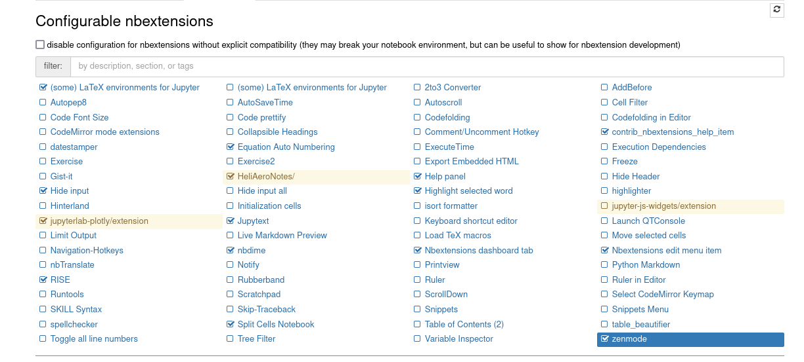

[](https://kumar-sumeet/HeliAeroNotes)

[](https://www.gnu.org/licenses/gpl-3.0)

# Fundamentals of Helicopter Aerodynamics (TUM) 
This repository comprises of a number of Jupyter Notebooks that compile together to form a Jupyter Book (see [here](https://kumar-sumeet.github.io/HeliAeroNotes/Opening.html)). This forms the course notes as well as the presentation slides used within the supplementary course [Fundamental of Helicopter Aerodynamics](https://www.asg.ed.tum.de/ht/teaching/lectures-summer-term/fundamentals-of-helicopter-aerodynamics/) offered at the Institute for Rotorcraft and Vertical Flight during the Summer Semester. This course has been offered at the institute in this format in 2022 and 2023. The next interation of this course would be offered in Summer 2024.


<!-- #region -->
## Requirements 


### RISE 

- using conda 

$ conda install -c conda-forge rise

- using pip 

$ pip install RISE


<!-- #endregion -->

<!-- #region -->
### NBextensions 


**1. Step** (Install the python package)


$ pip install jupyter_contrib_nbextensions

or, 

$ conda install -c conda-forge jupyter_contrib_nbextensions

**2. Step** (Install javascript and css files)

$jupyter contrib nbextension install --user

**3. Step** Enable extensions 

$ jupyter nbextension enable <nbextension require path>
<!-- #endregion -->

<!-- #region -->
## Enable configuration for nbextensions 





- **Split Cell Notebook**
This extension allows splitting cells. 

- **Hide input**
This extension allows hiding of an individual codecell in a notebook. This can be achieved by clicking on the toolbar button.

- **Equation Auto Numbering**
This extension enables equation autonumbering and resetting the equation count.

- **RISE**
Turn your Jupyter Notebooks into a live presentation (slideshow). 


The toolbar has to contain toggles shown bottom right of the above image. These are respectively for split cell, hide input, equation auto numbering, and RISE. 
<!-- #endregion -->

Note: If you have any problem with bibtex, make sure sphinxcontrib-bibtex is installed. 

install using , 

 $ pip install sphinxcontrib-bibtex


## How to build jupyter book

Please do not use jupyter book build alone since html images can not be copied. Use the following command. 


./buildhtml.sh

```bash

```
